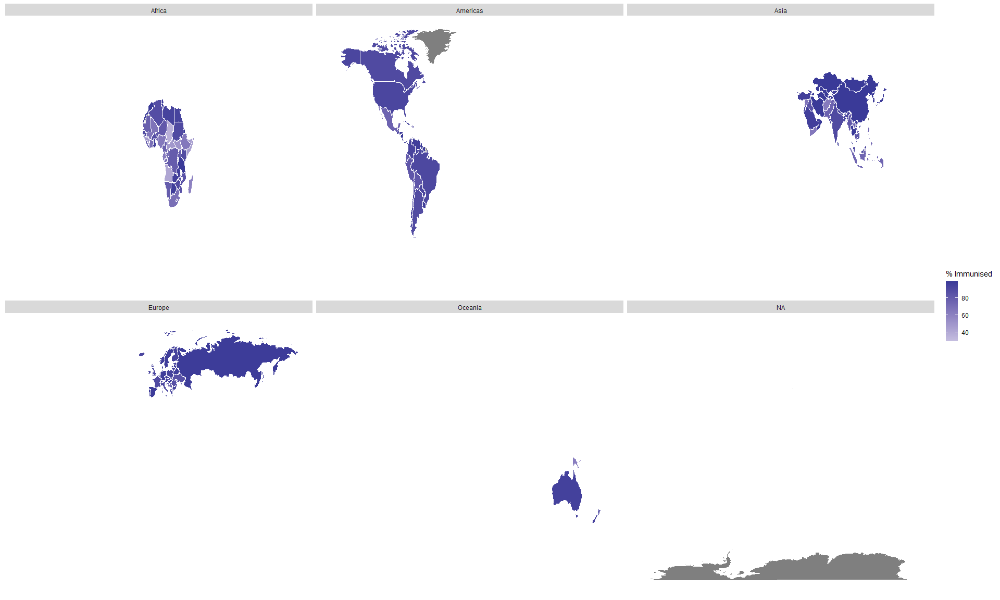
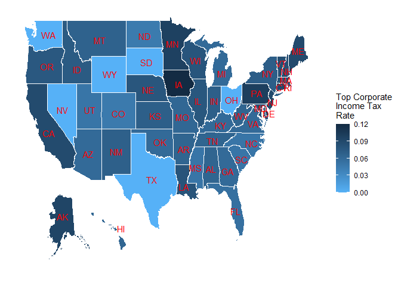
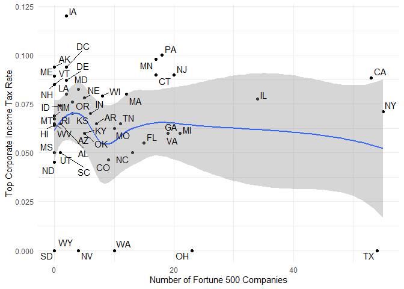
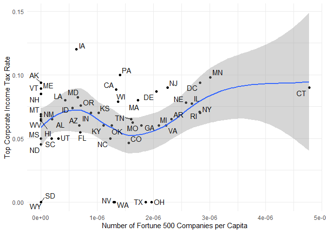
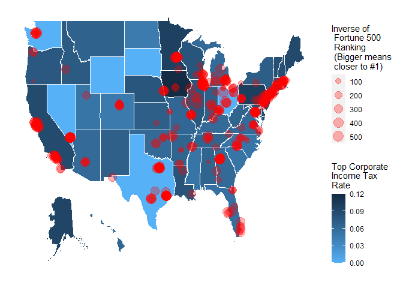

# World Map of Measles Vaccinations
## World Development Indicators (WDI)

For this exercise we will work with data from the World Development Indicators (WDI). Vincent Arel-Bundock provides a nice package for R that makes it easy to import the data. 


```r
# install.packages("WDI")
library(WDI)

library(readr)
library(xml2)
```

```
## Warning: package 'xml2' was built under R version 3.6.3
```

```r
library(rvest)
```

```
## Warning: package 'rvest' was built under R version 3.6.3
```

```r
library(httr)
library(readxl)
```

```
## Warning: package 'readxl' was built under R version 3.6.3
```

```r
library(tidyr)
```

```
## Warning: package 'tidyr' was built under R version 3.6.3
```

```r
library(dplyr)
```

```
## Warning: package 'dplyr' was built under R version 3.6.3
```

```r
library(tmaptools)
```

```
## Warning: package 'tmaptools' was built under R version 3.6.3
```

```r
library(maps)
library(urbnmapr)
library(ggrepel)
library(countrycode)
```

```
## Warning: package 'countrycode' was built under R version 3.6.3
```

## Select the data

Let's get some data on measles vaccinations. `SH.IMM.MEAS` seems like a good fit. But feel free to use another variable you find interesting.


```r
WDIsearch('measles')
```

```
##       indicator          
##  [1,] "SH.IMM.MEAS.Q5.ZS"
##  [2,] "SH.IMM.MEAS.Q4.ZS"
##  [3,] "SH.IMM.MEAS.Q3.ZS"
##  [4,] "SH.IMM.MEAS.Q2.ZS"
##  [5,] "SH.IMM.MEAS.Q1.ZS"
##  [6,] "SH.IMM.MEAS"      
##  [7,] "HF.IMM.MEAS.Q5"   
##  [8,] "HF.IMM.MEAS.Q4"   
##  [9,] "HF.IMM.MEAS.Q3"   
## [10,] "HF.IMM.MEAS.Q2"   
## [11,] "HF.IMM.MEAS.Q1"   
## [12,] "HF.IMM.MEAS"      
##       name                                                                    
##  [1,] "Vaccinations (Measles) (% of children ages 12-23 months): Q5 (highest)"
##  [2,] "Vaccinations (Measles) (% of children ages 12-23 months): Q4"          
##  [3,] "Vaccinations (Measles) (% of children ages 12-23 months): Q3"          
##  [4,] "Vaccinations (Measles) (% of children ages 12-23 months): Q2"          
##  [5,] "Vaccinations (Measles) (% of children ages 12-23 months): Q1 (lowest)" 
##  [6,] "Immunization, measles (% of children ages 12-23 months)"               
##  [7,] "Immunization, measles (% of children ages 15-23 months): Q5 (highest)" 
##  [8,] "Immunization, measles (% of children ages 15-23 months): Q4"           
##  [9,] "Immunization, measles (% of children ages 15-23 months): Q3"           
## [10,] "Immunization, measles (% of children ages 15-23 months): Q2"           
## [11,] "Immunization, measles (% of children ages 15-23 months): Q1 (lowest)"  
## [12,] "Immunization, measles (% of children ages 15-23 months)"
```

```r
df <- WDI(indicator = "SH.IMM.MEAS",
         start = 2017, end = 2017, extra = F)
df <- df %>% filter(!is.na(SH.IMM.MEAS))
```

## Questions

1. Use the map package and the measles data to make a world map of the share of infants vaccinated against measles.
2. Install the package `countrycode()` and use the countrycode function to add a region indicator to the dataset. Create a world map faceted by your region indicator.


```r
world_map <- map_data("world")
world_map$iso2c <- countrycode(world_map$region, "country.name", "iso2c")
```

```
## Warning in countrycode(world_map$region, "country.name", "iso2c"): Some values were not matched unambiguously: Ascension Island, Azores, Barbuda, Bonaire, Canary Islands, Chagos Archipelago, Grenadines, Heard Island, Kosovo, Madeira Islands, Micronesia, Saba, Saint Martin, Siachen Glacier, Sint Eustatius, Virgin Islands
```

```r
world_map$continent <- countrycode(world_map$iso2c, "iso2c", "continent")
```

```
## Warning in countrycode(world_map$iso2c, "iso2c", "continent"): Some values were not matched unambiguously: AQ, CC, GS, TF
```

```r
world_map <- left_join(world_map, df, by = "iso2c")

centroids <- read.csv("country_centroids.csv",
                      header = TRUE,
                      stringsAsFactors = FALSE)

colnames(centroids) <- c("iso2c", "cent_latitude", "cent_longitude", "country_name")

world_map <- left_join(world_map, centroids, by = "iso2c")
```


```r
ggplot(world_map) + 
  geom_polygon(aes(x = long, y = lat, group = group,  fill = SH.IMM.MEAS), color = "white") +
  scale_fill_gradient2(name = "% Immunised") +
  facet_wrap(~continent) + theme(axis.title.x = element_blank(),
                                 axis.title.y = element_blank(),
                                 axis.text.x = element_blank(),
                                 axis.text.y = element_blank(),
                                 axis.line.x = element_blank(),
                                 axis.line.y = element_blank(),
                                 axis.ticks.x = element_blank(),
                                 axis.ticks.y = element_blank(),
                                 panel.background = element_blank())
```

<!-- -->

# Locations of Fortune 500 companies

## Where are the Fortune 500 headquarters

For this exercise, we want to create a map of where the Fortune 500 companies - that is the five hundred largest U.S. corporations by total revenue - have their headquarters. 

## Addresses

Let's get the addresses here: https://www.geolounge.com/fortune-500-list-by-state-for-2015/


```r
fortune500 <- read_html("https://www.geographyrealm.com/fortune-500-list-by-state-for-2015/") %>%
  html_node(xpath = '//*[@id="tablepress-15"]') %>% 
  html_table()

colnames(fortune500) <- tolower(colnames(fortune500))
fortune500 <- subset(fortune500, 
                     select = c("company", "streetadd", "place", "state", "zip"))
write.csv(fortune500, "fortune500.csv")
```


## Load the associated file of addresses 

Load the list of Fortune 500 companies (in 2015).


```r
fortune500 <- read_csv("fortune500.csv")
```

```
## Warning: Missing column names filled in: 'X1' [1]
```

```
## Parsed with column specification:
## cols(
##   X1 = col_double(),
##   company = col_character(),
##   streetadd = col_character(),
##   place = col_character(),
##   state = col_character(),
##   zip = col_double()
## )
```

## Task 1: Make a map by state

**Task**: 
Aggregate the number of headquarters by state. Make a map in which the states are shaded by their number of Fortune 500 companies

Use `dplyr()` for the aggregation and the `maps()` package for a map of the U.S. with state boundaries.


```r
# Number of companies in each state
fortune_500_states <- fortune500 %>%
  group_by(state) %>%
  summarise("Number of Companies" = n())
```


```r
#Generate states map file
states_map <- get_urbn_map("states")
fortune_500_states_4plot <- states_map %>%
  left_join(fortune_500_states, by = c("state_name" = "state"))

# Replace NAs with 0
fortune_500_states_4plot$`Number of Companies` <- 
  replace_na(fortune_500_states_4plot$`Number of Companies`, 0)

# Get state centroids
state_centroids <- data.frame(state = state.abb,
                              centroid_x = state.center$x,
                              centroid_y = state.center$y,
                              stringsAsFactors = FALSE)

# Change Alaska's centroid
state_centroids$centroid_x[[2]] <- -116.8510
state_centroids$centroid_y[[2]] <- 27.3

# Change Hawaii's centroid
state_centroids$centroid_x[[11]] <- -104.9420
state_centroids$centroid_y[[11]] <- 26
```


```r
ggplot(fortune_500_states_4plot) +
  geom_polygon(aes(x = .data$long,
                   y = .data$lat,
                   group = .data$group,
                   fill = .data$`Number of Companies`),
               colour = "white") +
  scale_fill_continuous(name = "Number of\nFortune 500\nCompanies") +
  geom_text(data = state_centroids,
                  inherit.aes = FALSE,
                  aes(x = centroid_x, y = centroid_y, label = state), colour = "red") + 
  theme(axis.title.x = element_blank(),
        axis.title.y = element_blank(),
        axis.text.x = element_blank(),
        axis.text.y = element_blank(),
        axis.line.x = element_blank(),
        axis.line.y = element_blank(),
        axis.ticks.x = element_blank(),
        axis.ticks.y = element_blank(),
        panel.background = element_blank())
```

<!-- -->

## Task 2: Tax Rates by State

**Task**: 
We also got some info on top corporate income tax rates by state. Import sheet 2 of the file `State_Corporate_Income_Tax_Rates_2015.xlsx` and make a map shaded by top corporate income tax rates. 


```r
top_corp_Y_tax <- read_excel("State_Corporate_Income_Tax_Rates_2015.xlsx",
                sheet = "topcorptax")
top_corp_Y_tax$state[[51]] <- "District of Columbia"

fortune_500_states_4plot <- left_join(fortune_500_states_4plot,
                                      top_corp_Y_tax, by = c("state_name" = "state"))
```


```r
ggplot(fortune_500_states_4plot) +
  geom_polygon(aes(x = .data$long,
                   y = .data$lat,
                   group = .data$group,
                   fill = .data$topcorpinctax),
               colour = "white") +
  scale_fill_continuous(name = "Top Corporate\nIncome Tax\nRate",
                        low = "#56B1F7",
                        high = "#132B43") +
  geom_text(data = state_centroids,
                  inherit.aes = FALSE,
                  aes(x = centroid_x, y = centroid_y, label = state), colour = "red") + 
  theme(axis.title.x = element_blank(),
        axis.title.y = element_blank(),
        axis.text.x = element_blank(),
        axis.text.y = element_blank(),
        axis.line.x = element_blank(),
        axis.line.y = element_blank(),
        axis.ticks.x = element_blank(),
        axis.ticks.y = element_blank(),
        panel.background = element_blank())
```

<!-- -->

## Task 3: Scatter plot of income tax rates and # of headquarters

Is there evidence of companies being headquartered in low tax states? 

**Task**: 
1. Make a scatter plot with a loess function estimating the relationship between corporate income tax rates (x-axis) and # of headquarters (y-axis). 


```r
fortune_500_states_scatter <- fortune_500_states_4plot %>%
  select(state_abbv, `Number of Companies`, topcorpinctax) %>%
  unique()
```


```r
ggplot(fortune_500_states_scatter, aes(x = `Number of Companies`,
                                     y = topcorpinctax)) +
  geom_point() +
  geom_smooth(method = "loess", se = TRUE) +
  geom_text_repel(aes(label = state_abbv)) +
  labs(x = "Number of Fortune 500 Companies",
       y = "Top Corporate Income Tax Rate") +
  theme_minimal()
```

```
## `geom_smooth()` using formula 'y ~ x'
```

<!-- -->

2. What happens if we account for state population (i.e use HQs per capita)? Import the data on state populations from Wikipedia: https://en.wikipedia.org/wiki/List_of_U.S._states_and_territories_by_population. Use the function `readHTMLTable()` from the package `XML` to import the data and merge it on. Re-do the scatter plot from part 1. 


```r
pop <- read_html("https://en.wikipedia.org/wiki/List_of_states_and_territories_of_the_United_States_by_population") %>%
  html_node(xpath = '//*[@id="mw-content-text"]/div/table[1]') %>%
  html_table(fill = TRUE) 

colnames(pop) <- make.names(names(pop), unique = TRUE)

# Remove unnecessary columns, extra header, US Territories and Aggregate data
# Row 32 is Puerto Rico, 53 and beyond are aggregates and other territories
pop <- pop %>%
  dplyr::select(3:5) %>%
  slice(-1, -32, -c(54:61))

colnames(pop) <-  c("State", 
                    "Estimated_Census_Pop_2019",
                    "Census_Pop_2010")

pop <- mutate(pop,
              Estimated_Census_Pop_2019 = 
                as.numeric(stringr::str_remove_all(Estimated_Census_Pop_2019,
                                                   pattern = "[^0-9]")),
              Census_Pop_2010 = 
                as.numeric(stringr::str_remove_all(Census_Pop_2010,
                                                   pattern = "[^0-9]")))

# Get state abbreviations for joining
state_list <- data.frame(State = state.name,
                         state_abbv = state.abb,
                         stringsAsFactors = FALSE)

pop <- left_join(pop, state_list, by = "State")
pop$state_abbv[[49]] <- "DC"

# Merge with scatter data
fortune_500_states_scatter <- left_join(fortune_500_states_scatter,
                                        pop,
                                        by = "state_abbv")
```


```r
fortune_500_states_scatter <- mutate(fortune_500_states_scatter, HQs_per_capita_2019 = 
           .data$`Number of Companies`/.data$`Estimated_Census_Pop_2019`)
```


```r
ggplot(fortune_500_states_scatter, aes(x = HQs_per_capita_2019,
                                     y = topcorpinctax)) +
  geom_point() +
  geom_smooth(method = "loess", se = TRUE) +
  geom_text_repel(aes(label = state_abbv)) +
  labs(x = "Number of Fortune 500 Companies per Capita",
       y = "Top Corporate Income Tax Rate") +
  theme_minimal()
```

```
## `geom_smooth()` using formula 'y ~ x'
```

<!-- -->

## Geocoding

Now, let's get the Latitude and Longitude coordinates of all these addresses of the HQ addresses. Fortunately, ggmap() does this for us nicely.


```r
# This is Walmart's HQ address:
geocode_OSM("Arkansas 72716")$coords[1]
```

```
##         x 
## -94.23538
```

## Task 4: Geocode headquarter locations and add to the plot

**Task**: 
1. Geocode the locations of all headuarters in the sample. Add the locations of the headquarters as points to the map from part 2 (U.S. state map shaded by top corporate income tax rates).


```r
#Geocoding by city + state because OpenStreetMap doesn't return valid
# responses even for zip codes sometimes, let alone addresses
fortune500$search <- paste(fortune500$place, fortune500$state, "USA")
geos <- purrr::map(fortune500$search, geocode_OSM)
```

```
## Warning in FUN(X[[i]], ...): No results found for "Inver Grove Height
## Minnesota USA".
```

```
## Warning in FUN(X[[i]], ...): No results found for "South San Francisc
## California USA".
```


```r
x_coords <- purrr::map(1:500, function(x) as.numeric(geos[[x]][["coords"]][[1]]))
x_coords[lengths(x_coords) == 0] <- NA
x_coords <- unlist(x_coords)

y_coords <- purrr::map(1:500, function(x) as.numeric(geos[[x]][["coords"]][[2]]))
y_coords[lengths(y_coords) == 0] <- NA
y_coords <- unlist(y_coords)

fortune500_locations <- cbind(fortune500, x_coords, y_coords)

# Missing values
manual_OSM_search <- function(query, index) {
  coords <- geocode_OSM(query)$coords
  fortune500_locations$x_coords[index] <<- coords[1]
  fortune500_locations$y_coords[index] <<- coords[2]
}

# manual_OSM_search("3M headquarters", 98)
# manual_OSM_search("Lilly Technology Center", 151)
# manual_OSM_search("Fifth Third Tower", 416)
```


```r
ggplot(fortune_500_states_4plot) +
  geom_polygon(aes(x = .data$long,
                   y = .data$lat,
                   group = .data$group,
                   fill = .data$topcorpinctax),
               colour = "white") +
  scale_fill_continuous(name = "Top Corporate\nIncome Tax\nRate",
                        low = "#56B1F7",
                        high = "#132B43") +
  geom_point(data = fortune500_locations,
             inherit.aes = FALSE,
             aes(x = x_coords, y = y_coords, colour = "red")) + 
  theme(axis.title.x = element_blank(),
        axis.title.y = element_blank(),
        axis.text.x = element_blank(),
        axis.text.y = element_blank(),
        axis.line.x = element_blank(),
        axis.line.y = element_blank(),
        axis.ticks.x = element_blank(),
        axis.ticks.y = element_blank(),
        panel.background = element_blank())
```

```
## Warning: Removed 2 rows containing missing values (geom_point).
```

<!-- -->

2. Add a label with the company names. Use ggrepel() if the labels overlap too much.

Tried this, having 500 labels on the map turns the map into a sea of labels, even with ggrepel.

3. Size the points by the ranking on the Fortune 500 list (we don't have revenue here, so the rank will have to do). 


```r
ggplot(fortune_500_states_4plot) +
  geom_polygon(aes(x = .data$long,
                   y = .data$lat,
                   group = .data$group,
                   fill = .data$topcorpinctax),
               colour = "white") +
  scale_fill_continuous(name = "Top Corporate\nIncome Tax\nRate",
                        low = "#56B1F7",
                        high = "#132B43") +
  geom_point(data = fortune500_locations,
             inherit.aes = FALSE,
             aes(x = x_coords,
                 y = y_coords,
                 size = (501 - X1)),
             alpha = 0.3,
             colour = "red") + 
  labs(size = "Inverse of \n Fortune 500 \n Ranking \n (Bigger means \n closer to #1)") +
  theme(axis.title.x = element_blank(),
        axis.title.y = element_blank(),
        axis.text.x = element_blank(),
        axis.text.y = element_blank(),
        axis.line.x = element_blank(),
        axis.line.y = element_blank(),
        axis.ticks.x = element_blank(),
        axis.ticks.y = element_blank(),
        panel.background = element_blank())
```

```
## Warning: Removed 2 rows containing missing values (geom_point).
```

<!-- -->


